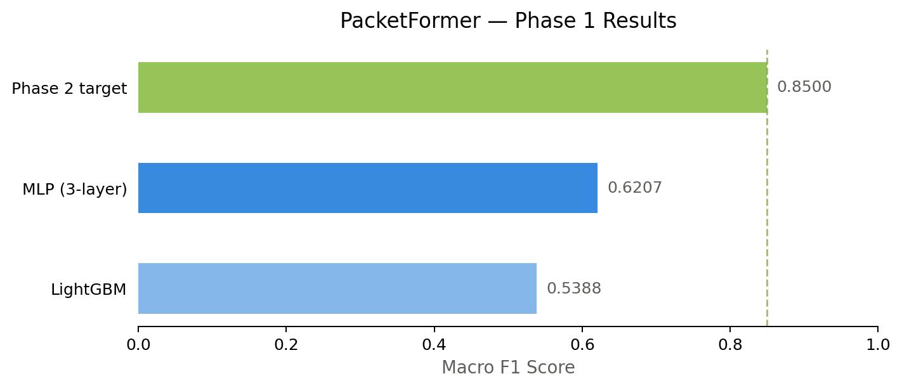

# PacketFormer
*A raw-packet Transformer for Network Intrusion Detection, optimized for AMD ROCm and MI300X.*


Most network intrusion detection systems train on pre-extracted flow features — 
spreadsheet-style rows with packet counts, byte averages, timing stats. It works 
okay, but you're throwing away most of the signal. PacketFormer skips the feature 
engineering and learns directly from raw packet bytes, the same way language models 
learn from raw text.

The goal is a transformer pre-trained on unlabeled network traffic, then fine-tuned 
to detect attacks. It runs on PyTorch + ROCm, targeting AMD MI300X hardware.

---

## How it works

The pipeline is straightforward:

\```
Raw PCAPs
   │
   ▼
Byte-level tokenizer (PacketTokenizer)
   │
   ▼
Transformer Encoder (125M–350M params)
   │  ↑ pre-train: masked token prediction
   │  ↓ fine-tune: flow classification
   ▼
[Optional] Graph Attention Network
   │         (hosts = nodes, flows = edges)
   ▼
Attack classification / alert
\```

There are three phases:

**Phase 1 (done):** Train MLP and LightGBM classifiers on CICIDS2017 flow features.
This establishes the baseline numbers that Phase 2 needs to beat.

**Phase 2:** Build the actual transformer. Pre-train it with masked token prediction
on raw unlabeled captures, then fine-tune on CICIDS2017/2018 and UNSW-NB15. This is
where the MI300X comes in.

**Phase 3:** Add a Graph Attention Network on top of the per-flow embeddings. Model
the network as a graph where hosts are nodes and flows are edges. This catches
distributed attacks like botnet coordination that per-flow models miss completely,
because those attacks only look suspicious when you see all the flows together.

---

## Progress

- [x] **Phase 1**   Baseline classifier, data pipeline, benchmarks
- [ ] **Phase 2**   Transformer pre-training on ROCm / MI300X
- [ ] **Phase 3**  GAT extension, real-time inference, Docker + ROCm container

---

## Why this needs the MI300X

Pre-training a 125M-parameter transformer at 2048-token context over 50GB of
tokenized packet data needs roughly 80-120GB of GPU memory. That's before you add
the graph structure in Phase 3.

The MI300X has 192GB of unified memory, which means the model, token sequences, and
graph can all live in the same memory space during training. Without that, you're
either doing aggressive graph partitioning (which hurts model quality) or splitting
across multiple GPUs (which adds communication overhead and complexity).

Target hardware: **AMD Instinct MI300X (192GB unified memory)**
Stack: **PyTorch + ROCm**

---

## Dataset

Phase 1 uses **CICIDS2017** from the Canadian Institute for Cybersecurity. Download
instructions are in [`data/README.md`](data/README.md).

Phase 2 adds:
- CICIDS2018
- UNSW-NB15
- CAIDA / MAWI unlabeled captures for pre-training

---

## Prerequisites

- Python 3.10+
- At least 32GB RAM for Phase 1 preprocessing (2.8M rows)
- AMD GPU with ROCm 6.0+ required for Phase 2 and above
- Phase 1 runs on CPU only, no GPU needed
## Running Phase 1

\```bash
git clone https://github.com/Sanh22/packetformer
cd packetformer
pip install -r requirements.txt
# download CICIDS2017 CSVs and place them in data/raw/ (see data/README.md)
python src/preprocess.py
python src/train.py
\```

---

## Phase 1 Results


Trained on CICIDS2017 flow features (84 columns, 2,827,876 rows after cleaning).
Macro F1 is the honest metric here -- accuracy looks great on imbalanced data even
when the model completely ignores rare attack classes.

| Model | Accuracy | F1 (macro) | Notes |
|-------|----------|------------|-------|
| MLP (3-layer, 207K params) | 98.42% | 0.6207 | CPU, 20 epochs |
| LightGBM | 99.59% | 0.5388 | CPU |
| PacketFormer (Phase 2) | TBD | TBD | Target: F1 > 0.85, requires MI300X |

The macro F1 is lower than you'd expect because some attack classes have fewer than
10 samples in the dataset. The model just never learns them. That's a known
limitation of training on tabular features with this dataset, and it's part of why
the raw-packet approach in Phase 2 should do better.

---

## Repo structure

\```
packetformer/
├── data/
│   ├── raw/           # CICIDS2017 CSVs go here (gitignored)
│   └── README.md      # download instructions
├── src/
│   ├── preprocess.py  # cleaning, tokenization
│   ├── dataset.py     # PyTorch Dataset
│   ├── model.py       # transformer + MLP baseline
│   └── train.py       # training loop
├── notebooks/
│   └── baseline_exploration.ipynb
├── requirements.txt
└── README.md
\```

---

## ROCm

One of the goals here is to make this a real public reference for ROCm native ML
training. There's almost nothing out there for cybersecurity ML on ROCm and AMD's
developer relations team has mentioned they actively look for this kind of project.

Phase 2 will include:
- `torch.compile` with ROCm backend
- ROCfprof profiling
- Side by side benchmark: ROCm vs CUDA on the same workload

---

## License

MIT
